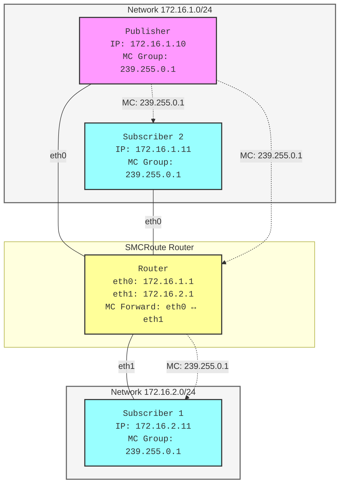

# Aeron Research Project

This project demonstrates Aeron UDP messaging across containerized networks with monitoring capabilities.

## Network Topology



## Project Structure

- **Media Driver**: Manages Aeron's shared memory and network resources
- **Publisher**: Sends messages via Aeron UDP
- **Subscribers**: Two subscribers in different networks
- **Router**: Handles cross-network packet forwarding

## Components

### Infrastructure

- `Dockerfile`: Ubuntu-based image with Java, networking tools, and monitoring capabilities
- `docker-compose.yml`: Multi-container setup with custom networks
- Shell scripts for running components:
  - `run-md.sh`: Media Driver startup
  - `run-pingpong-sub1.sh`: RTT Subscriber1 startup
  - `run-pingpong-pub1.sh`: RTT Publisher->Subscriber1 startup
  - `run-publisher.sh`: Publisher startup
  - `run-subscriber.sh`: Subscriber startup


## Network Configuration

- **Network A**: 172.16.1.0/24
  - Publisher: 172.16.1.10
  - Subscriber 2: 172.16.1.11
  - Router Interface: 172.16.1.1

- **Network B**: 172.16.2.0/24
  - Subscriber 1: 172.16.2.11
  - Router Interface: 172.16.2.1

### Multicast configuration

- Multicast routing is statically configured on the router with https://github.com/troglobit/smcroute
- The configuration is volume mapped in via the folder ```config/smcroute.conf``` to ```/etc/smcroute.conf```
- the ethernet adapters on the router are named 
  - eth0
  - eth1
- in the order the networks are defined, that is to say: 
  - eth0 interface is in network_a 
  - eth1 interface is in network_b

- default ttl on multicast is 1 unless set by the producer or the router.
- For publisher1 to reach subscriber1, we need a ttl>=2
- This can be configured on the aeron publication channel
  - ``aeron:udp?endpoint=239.255.0.1:40456|ttl=2``

## Build and Dependencies

Using Gradle with shadowJar plugin for fat JAR creation:
- Aeron Driver: 1.47.2
- Agrona: 2.0.1
- Aeron All: 1.47.2

## Monitoring Tools

Built-in capabilities for:
- Wireshark packet capture
- tcpdump analysis
- Aeron monitoring via aeronstat
- Network performance testing with iperf3
- System monitoring with sysstat and htop

## Getting Started

1. Build the project:
```bash
./gradlew build
```

2. Start the containers:
```bash
docker-compose up
```

2a. Log into each container using 'docker compose'
```bash
docker compose exec subscriber1 bash
docker compose exec publisher bash
```

4. Start rtt subscriber1:
```bash
cd /app/scripts
./run-pingpong-sub1.sh
```

5. Start publisher:
```bash
./run-pingpong-pub1.sh
```

## Monitoring

Monitor Aeron internals:
```bash
java --add-opens java.base/sun.nio.ch=ALL-UNNAMED \
     --add-opens java.base/java.nio=ALL-UNNAMED \
     --add-opens java.base/jdk.internal.misc=ALL-UNNAMED \
     -Daeron.dir=/dev/shm/aeron \
     -cp /app/build/libs/aeron-research-1.0-SNAPSHOT-all.jar \
     io.aeron.samples.AeronStat
```

## Architecture Notes

- Uses shared memory (`/dev/shm/aeron-${SERVICE_NAME}`) for Media Driver communication
- Cross-network routing enabled via Docker networks
- UDP messaging on port 20121
- Dedicated thread mode for Media Driver

## Security Notes

- Containers run in privileged mode for network capabilities
- NET_ADMIN and NET_RAW capabilities enabled
- Host IPC namespace shared for shared memory access

## Known Limitations

- can always be more badass
