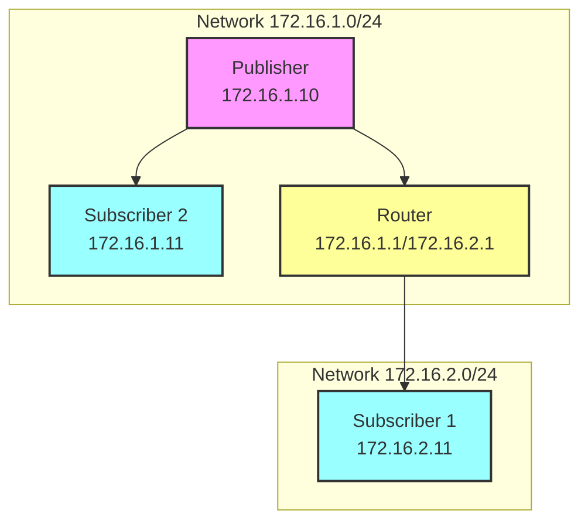

# Aeron Research Project

This project demonstrates Aeron UDP messaging across containerized networks with monitoring capabilities.

## Network Topology



## Project Structure

- **Media Driver**: Manages Aeron's shared memory and network resources
- **Publisher**: Sends messages via Aeron UDP
- **Subscribers**: Two subscribers in different networks
- **Router**: Handles cross-network packet forwarding

## Components

### Java Classes

- `Configuration.java`: Central configuration for Aeron channels and directories
- `AeronDriver.java`: Media Driver initialization and management
- `Publisher.java`: Message publisher implementation
- `Subscriber.java`: Message subscriber implementation

### Infrastructure

- `Dockerfile`: Ubuntu-based image with Java, networking tools, and monitoring capabilities
- `docker-compose.yml`: Multi-container setup with custom networks
- Shell scripts for running components:
  - `run-md.sh`: Media Driver startup
  - `run-publisher.sh`: Publisher startup
  - `run-subscriber.sh`: Subscriber startup

## Network Configuration

- **Network A**: 172.16.1.0/24
  - Publisher: 172.16.1.10
  - Subscriber 2: 172.16.1.11
  - Router Interface: 172.16.1.1

- **Network B**: 172.16.2.0/24
  - Subscriber 1: 172.16.2.11
  - Router Interface: 172.16.2.1

## Build and Dependencies

Using Gradle with shadowJar plugin for fat JAR creation:
- Aeron Driver: 1.47.2
- Agrona: 2.0.1
- Aeron All: 1.47.2

## Monitoring Tools

Built-in capabilities for:
- Wireshark packet capture
- tcpdump analysis
- Aeron monitoring via aeronstat
- Network performance testing with iperf3
- System monitoring with sysstat and htop

## Getting Started

1. Build the project:
```bash
./gradlew shadowJar
```

2. Start the containers:
```bash
docker-compose up -d
```

3. On each container, start the Media Driver:
```bash
cd /app/scripts
./run-md.sh
```

4. Start subscribers:
```bash
./run-subscriber.sh
```

5. Start publisher:
```bash
./run-publisher.sh
```

## Monitoring

Monitor Aeron internals:
```bash
java --add-opens java.base/sun.nio.ch=ALL-UNNAMED \
     --add-opens java.base/java.nio=ALL-UNNAMED \
     --add-opens java.base/jdk.internal.misc=ALL-UNNAMED \
     -Daeron.dir=/dev/shm/aeron \
     -cp /app/build/libs/aeron-research-1.0-SNAPSHOT-all.jar \
     io.aeron.samples.AeronStat
```

## Architecture Notes

- Uses shared memory (`/dev/shm/aeron`) for Media Driver communication
- Cross-network routing enabled via Docker networks
- UDP messaging on port 20121
- Dedicated thread mode for Media Driver

## Security Notes

- Containers run in privileged mode for network capabilities
- NET_ADMIN and NET_RAW capabilities enabled
- Host IPC namespace shared for shared memory access

## Known Limitations

- Media Driver timeouts require proper shutdown handling
- Client liveness monitoring needed for production use